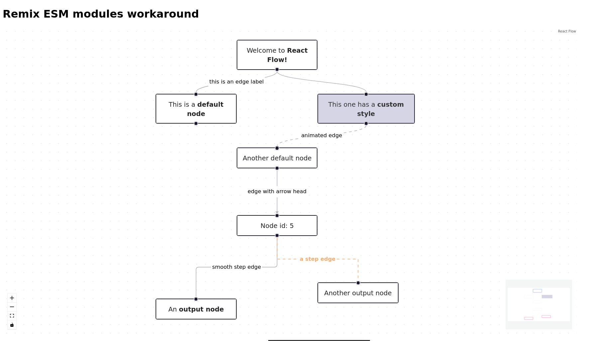

# Remix ESM module workaround

## Important note : not useful anymore for React Flow
React flow can now be imported normally into remix, see https://github.com/wbkd/react-flow/issues/1953#issuecomment-1095137621m

The fix can be still useful for other packages

---



Run it with `npm run dev`

## Files added

- [`esm-module.ts`](https://github.com/abc3354/remix-esm-workaround/blob/main/esm-module.ts)
    stores the dynamic imports of the ESM modules


- [`app/moduleLoader.tsx`](https://github.com/abc3354/remix-esm-workaround/blob/main/app/moduleLoader.tsx)
    exports a wrapper element called `ModuleLoader` and a hook called `useModuleLoader`

  
- [`app/components/flow.tsx`](https://github.com/abc3354/remix-esm-workaround/blob/main/app/components/flow.tsx)
    is [React Flow first example](https://reactflow.dev/docs/examples/overview/), modified with `useModuleLoader`


- [`app/components/initial-elements.tsx`](https://github.com/abc3354/remix-esm-workaround/blob/main/app/components/initial-elements.tsx)
    is also from the React Flow example, note that `initialEdges` have been modified
    to receive the `ReactMarker` enum since it can't fetch it itself

## Usage

### Component using useModuleLoader

```tsx
const OverviewFlow = () => {

    const {
        default: ReactFlow,
        addEdge,
        MiniMap,
        Controls,
        Background,
        useNodesState,
        useEdgesState,
        MarkerType,
      } = useModuleLoader("react-flow-renderer") as any;
    
    // ...
}
```

*From [app/components/flow.tsx](https://github.com/abc3354/remix-esm-workaround/blob/main/app/components/flow.tsx)*

### Wrapping 

A component using `useModuleLoader` should be wrapped in a `ModuleLoader`  
The string used as index will be used as the argument for `useModuleLoader`

```tsx
<ModuleLoader imports={{ "react-flow-renderer": getReactFlowRenderer }}>
    <Flow />
</ModuleLoader>
```

*From [app/routes/index.tsx](https://github.com/abc3354/remix-esm-workaround/blob/main/app/routes/index.tsx)*

### Dynamics imports

```tsx
module.exports = {
    getReactFlowRenderer: async () => await import("react-flow-renderer"),
};
```

*From [esm-module.ts](https://github.com/abc3354/remix-esm-workaround/blob/main/esm-module.ts)*

## Additionnal information

### Types

I did not manage to make the types work so typescript and your IDE will have no informations on the import.  

However, you can import types using a regular static import statement without crash, if :
- you are not importing the same type with `useModuleLoader`
- you are using the imported type only for type checking with typescript

Example in [app/components/flow.tsx](https://github.com/abc3354/remix-esm-workaround/blob/main/app/components/flow.tsx)

```tsx
import type { ReactFlowInstance, OnConnect, Edge, Node } from "react-flow-renderer";

// ...

const onConnect: OnConnect = (params) =>
    setEdges((eds: Edge[]) => addEdge(params, eds));
```
